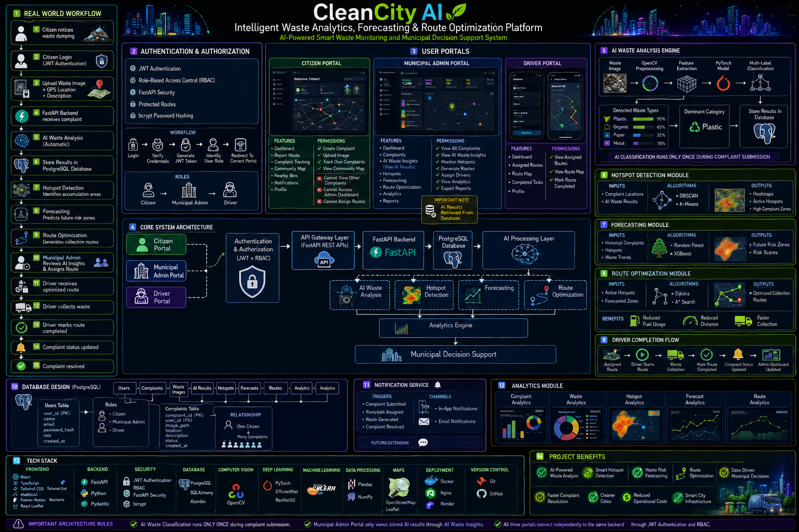

# CleanCityAI 🚮🤖

## AI-Powered Smart Waste Management Platform

CleanCityAI is a smart city solution designed to improve municipal waste management through complaint tracking, AI-assisted waste analysis, hotspot detection, forecasting, and route optimization.

The platform enables citizens to report waste issues, administrators to manage operations, and drivers to efficiently complete waste collection tasks.

---

# Project Architecture


---

# Key Features

## Citizen Module

* User Registration & Login
* JWT Authentication
* Submit Waste Complaints
* Upload Waste Images
* Track Complaint Status
* Receive Notifications

## Admin Module

* View All Complaints
* Verify Complaints
* Assign Drivers
* Update Complaint Status
* Generate Hotspots
* Generate Forecasts
* Generate Routes

## Driver Module

* View Assigned Tasks
* View Complaint Details
* Update Task Status
* Complete Assigned Jobs

---

# AI & Smart City Features

## Waste Analysis

* Waste Category Detection
* Severity Scoring
* Priority Assignment

## Hotspot Detection

Identifies waste-prone locations using complaint clustering.

Outputs:

* Complaint Count
* Average Severity
* Risk Level

## Forecasting

Predicts future waste accumulation using historical hotspot information.

Outputs:

* Current Complaints
* Predicted Complaints
* Predicted Risk Level

## Route Optimization

Generates collection routes based on forecasted waste volume and priority.

Current Version:

* Priority-Based Route Planning

Planned Upgrade:

* Nearest Neighbor Algorithm
* Dijkstra Algorithm
* A* Search

---

# Workflow

Citizen Reports Waste
↓
Image Upload
↓
AI Analysis
↓
Priority Assignment
↓
Admin Verification
↓
Driver Assignment
↓
Task Completion
↓
Notifications
↓
Hotspot Detection
↓
Forecasting
↓
Route Optimization

---

# Database Modules

* Users
* Complaints
* Drivers
* Assignments
* Notifications
* AI Results
* Hotspots
* Forecasts
* Routes

---

# Technology Stack

## Backend

* FastAPI
* Python
* SQLAlchemy
* Alembic

## Database

* PostgreSQL

## Authentication

* JWT Authentication
* Role-Based Access Control (RBAC)

## AI / Analytics

* Waste Categorization
* Severity Prediction
* Hotspot Detection
* Forecasting
* Route Optimization

## Version Control

* Git
* GitHub

---

# API Modules

## Authentication

* Register User
* Login User
* Current User

## Complaints

* Create Complaint
* View My Complaints
* Complaint Details

## Admin

* View Complaints
* Assign Driver
* Verify Complaint
* Update Status

## Driver

* View Tasks
* Update Task Status

## Notifications

* View Notifications

## Hotspots

* Generate Hotspots
* View Hotspots

## Forecasting

* Generate Forecasts
* View Forecasts

## Routes

* Generate Routes
* View Routes

---

# Project Structure

```text
backend/
├── api/
├── database/
├── storage/

ai_engine/
├── waste_classification/
├── hotspot_detection/
├── forecasting/
├── route_optimization/

frontend/

docs/

deployment/
```

---

# Sample Results

### Hotspot Detection

```json
{
  "latitude": 16.51,
  "longitude": 80.65,
  "complaint_count": 4,
  "risk_level": "Critical"
}
```

### Forecasting

```json
{
  "current_complaints": 4,
  "predicted_complaints": 6,
  "predicted_risk": "Critical"
}
```

### Route Optimization

```json
{
  "stop_number": 1,
  "latitude": 16.51,
  "longitude": 80.65,
  "predicted_complaints": 6,
  "predicted_risk": "Critical"
}
```

---

# Future Enhancements

* YOLO-Based Waste Image Classification
* Nearest Neighbor Route Optimization
* Dijkstra & A* Routing
* Interactive Analytics Dashboard
* Mobile Application
* Real-Time GPS Tracking
* Smart Bin Integration
* Predictive Waste Collection Scheduling

---

# Author

**Vinayak Tata**

CleanCityAI – Smart Waste Management for Smart Cities 🌍
